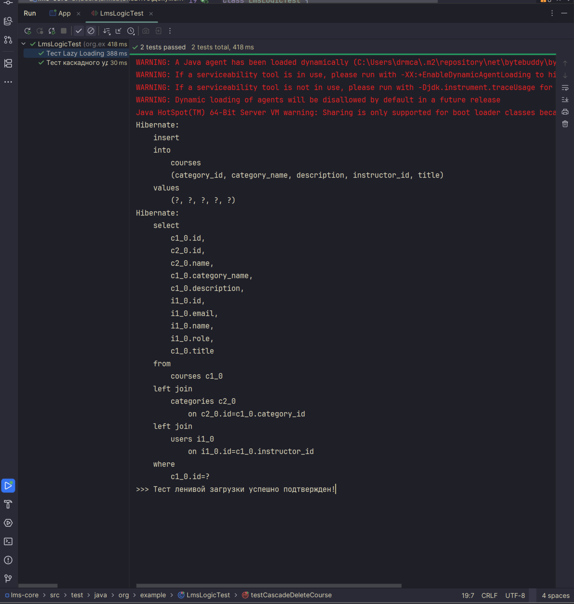
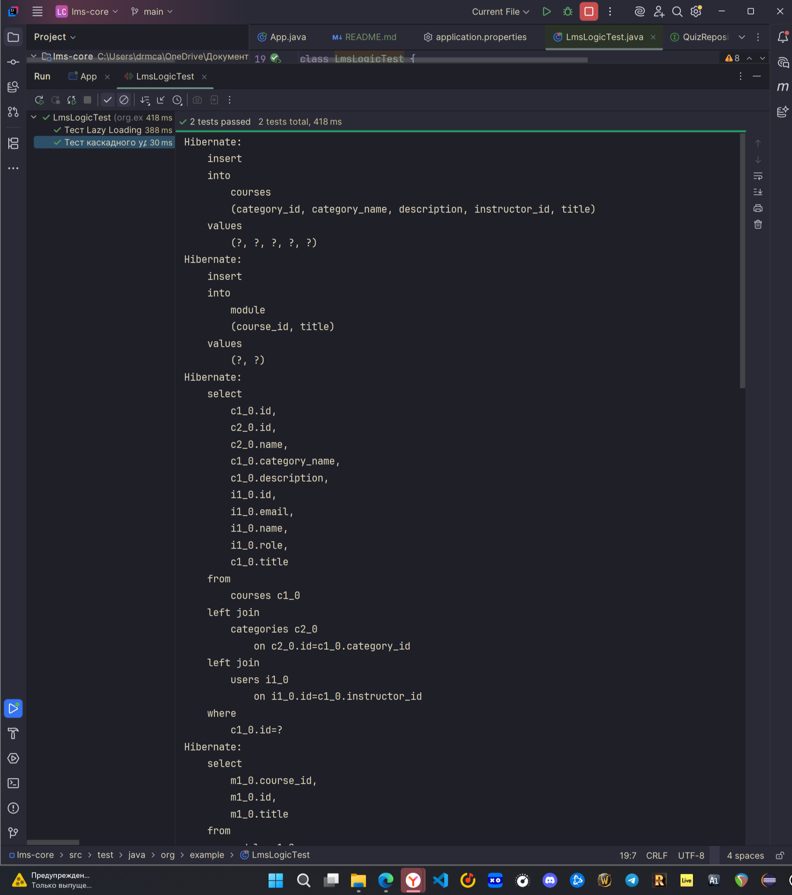
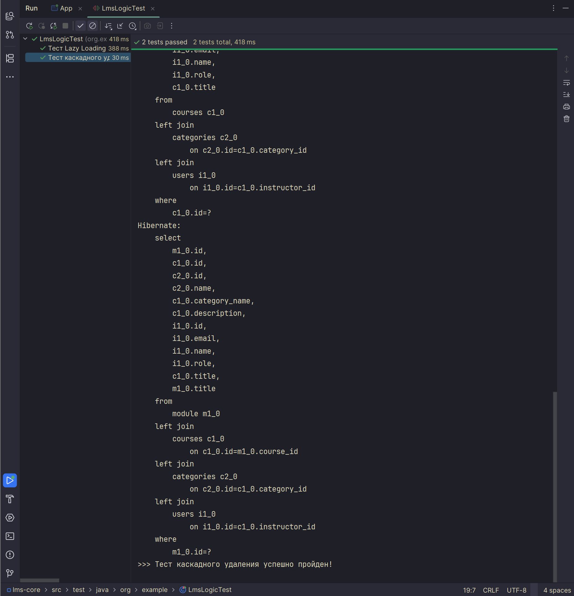
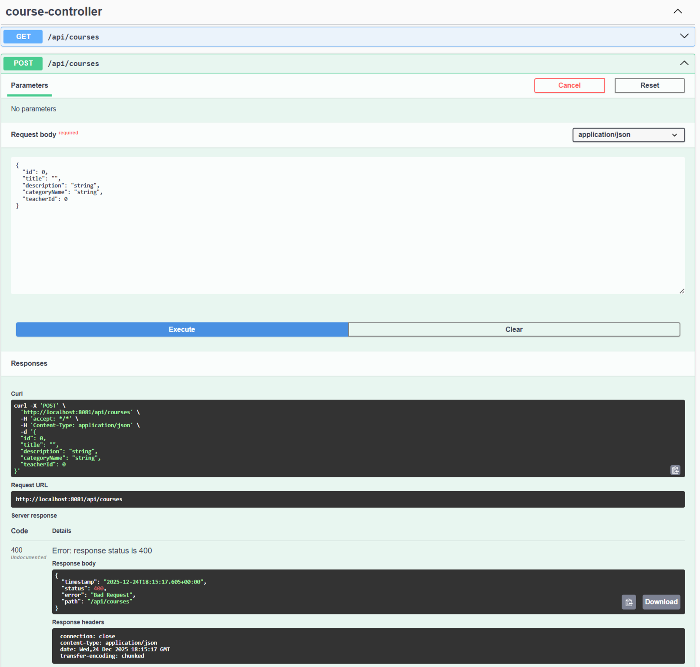

# LMS Core System — Система управления обучением

Бэкенд-платформа для образовательных курсов на Spring Boot 3.2 и PostgreSQL. Проект реализует управление контентом, связи между сущностями и интеграционное тестирование.

## 🛠 Технологический стек
- **Java 22**
- **Spring Boot 3.2** (Data JPA, Web, Validation)
- **PostgreSQL** — основная база данных.
- **Swagger (SpringDoc) — тестирование API.**
- **Lombok** — для чистоты кода.

---

## 🚀 Инструкция по запуску

### 1. Клонирование репозитория
git clone https://github.com/drmcastles/lms-core.git
cd lms-core

### 2. Подготовка базы данных
1. Убедитесь, что установлена PostgreSQL.
2. Создайте пустую базу данных **lms_db**.

### 3. Настройка подключения (application.properties)
Отредактируйте файл `src/main/resources/application.properties`:

server.port=8081
spring.datasource.url=jdbc:postgresql://localhost:5433/lms_db
spring.datasource.username=postgres
spring.datasource.password=1151
spring.jpa.hibernate.ddl-auto=create
spring.jpa.show-sql=true

### 4. Запуск
Запустите основной класс **LmsCoreApplication** в IDE или через Maven:
mvn spring-boot:run

---

## 🧪 Тестирование

### 1. Автоматические тесты (LmsLogicTest.java)
В проекте реализован класс `LmsLogicTest` для проверки работы Hibernate:
- **testCascadeDeleteCourse**: Проверяет каскадное удаление (CascadeType.ALL). При удалении курса автоматически удаляются связанные модули.
- **testLazyLoadingException**: Подтверждает работу FetchType.LAZY. Доступ к связанным данным вне сессии вызывает LazyInitializationException.

### 2. Валидация (Swagger)
Для проверки Критерия 10:
1. Откройте http://localhost:8081/swagger-ui/index.html
2. Выполните POST запрос к /api/courses с пустым полем "title".
3. Система вернет **400 Bad Request**, подтверждая работу аннотаций валидации.

---

## 📸 Скриншоты с логами тестов
(Файлы находятся в папке /screenshots)

1 **Успешное прохождение тестов**
   

2**Логи LazyLoading**
   

3**Логи каскадного удаления (Hibernate SQL)**
   
   

4**Результат валидации API**
   
   *Скриншот из Swagger UI с ответом 400 Bad Request.*

5**Процент покрытия тестами**
